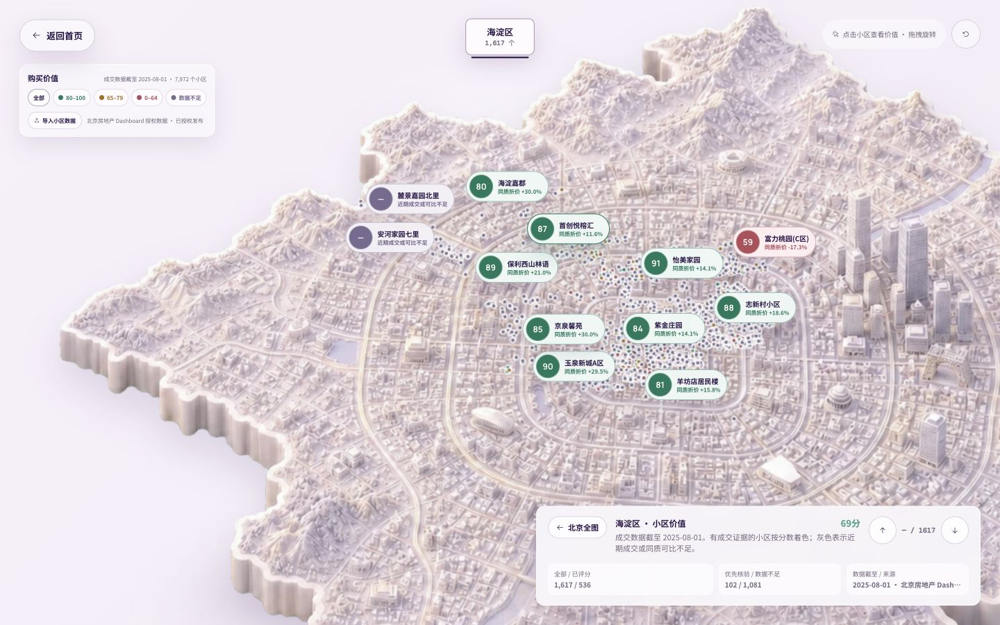
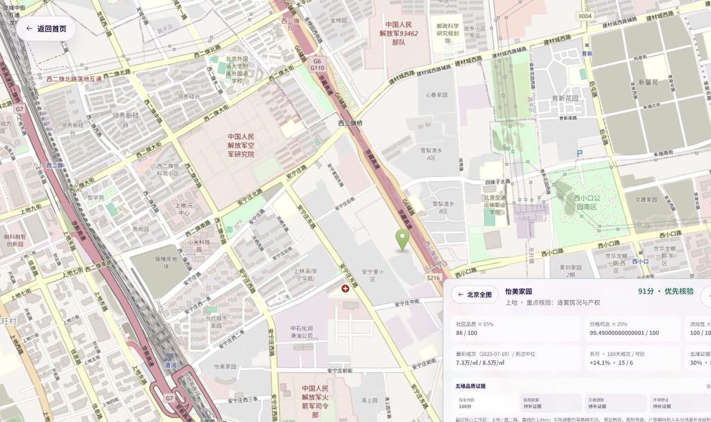
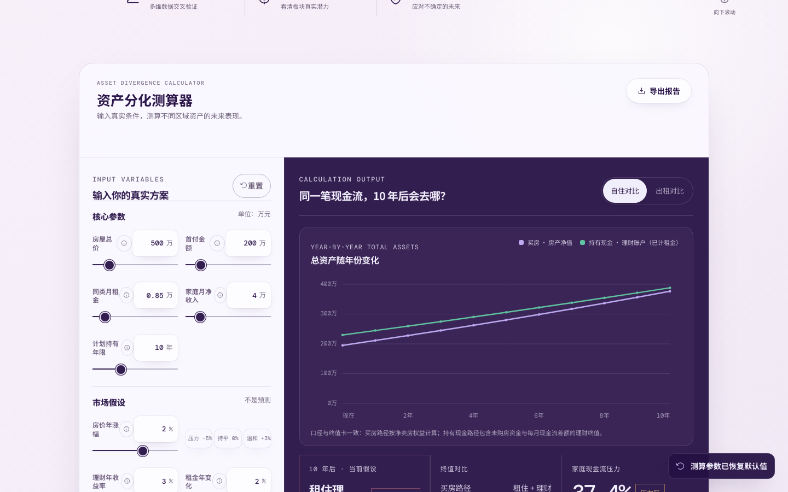

# 资产分化实验室

> 在线北京房屋交易价值地图 + 买房现金流测算器 + 房源证据评分卡

[](https://github.com/LiuLi4/asset-divergence-lab/actions/workflows/deploy.yml)

**[在线体验](https://liuli4.github.io/asset-divergence-lab/)** · **[地图数据说明](docs/community-data.md)**

资产分化实验室是一个面向北京购房者的开源决策实验工具。它不预测房价，也不直接替你给出“该不该买”的答案，而是把决策拆成三组可检查的问题：这个小区的成交证据是否充分、同一笔现金流买房还是持有现金更合适、候选房源的品质与流动性是否经得住核验。


## 完整功能说明

| 功能 | 可以完成的操作 | 输出或反馈 |
| --- | --- | --- |
| 3D 北京总览 | 拖拽或用方向键调整视角，点击地图或七个区县标签进入全屏工作台 | 每区可查看小区数量、数据截止日期和全图重置入口 |
| 七区价值地图 | 下钻海淀、朝阳、石景山、西城、丰台、通州、大兴；筛选 `80–100`、`65–79`、`0–64` 和“数据不足” | 全部/已评分、优先核验/数据不足、区县均分、来源和时间戳 |
| 小区交易证据 | 点击任意点位或重点名称；用上下按钮循环查看当前筛选结果 | 最新成交、周边同质中位价、折价、180 天成交、可比样本、风险提示 |
| 小区位置与品质证据 | 查看五维品质覆盖、最近核心工作区、周边小区距离和 OpenStreetMap | 缺失项明确显示“待补证据”，不会用默认分制造完整评分 |
| 本地数据导入 | 导入符合约定格式、最多 50,000 个小区的 JSON，覆盖默认地图 | 浏览器内校验并即时重绘；文件不会上传 |
| 买房现金流测算 | 在自住或出租口径下编辑房价、首付、租金、收入、持有期、涨幅、理财收益、贷款和成本 | 买房/替代投资终值、差额、净卖房权益、剩余贷款、累计利息和持有成本 |
| 总资产与压力测试 | 查看逐年总资产曲线，切换房价快捷假设或套用三类资产情景 | 临界涨幅、房价 × 理财收益矩阵、月供占比和收入下降后的压力等级 |
| 房源证据评分卡 | 为三个候选独立命名，逐项调整七个维度并来回切换 | 品质、价格机会、流动性、购买价值总分和三套房并排比较 |
| 保存与导出 | 自动保存当前测算口径、输入和候选房源，随时重置默认值 | 下载包含输入、结果、逐年曲线和候选评分的 JSON 报告 |
| 响应式与无障碍 | 在桌面、平板和手机使用；键盘操作地图与曲线；尊重减少动态效果设置 | 移动菜单、静态地图降级、屏幕阅读器标签和可访问图表数据 |

所有个人输入都在浏览器本地计算和保存。你可以导出完整 JSON 报告，也可以导入自己的小区数据覆盖默认地图；这些文件和输入不会上传到服务器。

## 在线系统截图

### 北京七区交易价值地图

进入区县后，首页地图会展开为全屏工作台。下图是线上系统加载当前生产数据后的海淀区视图；不同颜色对应购买价值分层，灰色表示成交或同质可比证据不足。



### 小区成交、评分和周边证据

选择小区后，地图切换到 OpenStreetMap 周边视图，并同时展示最新成交、周边中位价、折价、成交/可比样本、品质证据覆盖和最近核心工作区。



### 买房现金流与逐年总资产

测算参数与结果并排更新，曲线展示买房净资产和持有现金/理财账户在整个持有期内的变化，而不只比较期末单点。



### 三类资产压力情景

三张情景卡用于快速回填房价涨幅和租售比假设，目的是让同一套方案先经历不同压力测试，不是给具体小区自动贴标签。


### 三套房源证据评分卡

候选房源可以独立命名和评分，右侧保留三套房的购买价值、品质与类别摘要，方便看房后集中复盘。


### 移动端

<p align="center">
  
</p>

## 在线地图怎么用

1. 打开[在线网站](https://liuli4.github.io/asset-divergence-lab/)，点击首页北京地图或任一区县标签进入全屏地图工作台。
2. 选择海淀、朝阳、石景山、西城、丰台、通州或大兴，地图会展示该区全部小区点位和已评分/数据不足数量。
3. 用图例筛选 `80–100`、`65–79`、`0–64` 或“数据不足”。有成交证据的小区按分数着色，灰色点位不会生成伪精确分数。
4. 点击点位或名称查看小区详情，包括最新成交、周边同质样本中位数、折价、近 180 天成交数、可比样本数、品质/价格机会/流动性拆分和证据覆盖率。
5. 用上下按钮逐个浏览当前筛选结果；有坐标的小区还会显示 OpenStreetMap 周边道路、500 米/1 公里内小区数量和最近三个小区参照。
6. 点击“北京全图”返回区县总览，点击“返回首页”退出工作台；键盘用户也可以用 `Enter` 进入、方向键调整视角、`Esc` 逐层返回。

地图是购房线索排序工具，不是自动估价器。展示位置基于公开或获授权坐标投影到艺术地图，并非测绘或产权边界；医院等级、学区资格、实际步行通勤、户型朝向、噪声、物业和产权仍需线下核验。

## 地图数据快照

当前生产地图使用截止 **2025-08-01** 的获授权派生数据：

| 指标 | 数量 |
| --- | ---: |
| 七区小区点位 | 7,972 |
| 有近 180 天成交且至少有 3 个同质可比样本，参与评分 | 2,578 |
| 成交或同质可比不足，明确显示“数据不足” | 5,394 |
| 80–100 分 / 65–79 分 / 0–64 分 | 549 / 822 / 1,207 |

地图使用以下购买价值口径：

```text
价格机会分 = clamp(50 + 同质可比折价 × 3.5, 0, 100)
购买价值分 = 品质分 × 65% + 价格机会分 × 25% + 流动性分 × 10% − 风险扣分
```

其中“同质可比”会优先比较同板块、相近楼龄、面积和户型的近期成交；低品质资产还会受到上限约束，避免低价掩盖基本面短板。数据不足时保留点位但不评分。

仓库另带一份可复现的 **4,590 个**北京七区 OpenStreetMap 住宅要素目录，用于名称与 WGS84 坐标底表。它遵守 ODbL 1.0，与 7,972 个获授权交易价值点位不是同一数据集，也不包含成交价。来源、许可边界、字段格式、覆盖率和构建方式详见 [`docs/community-data.md`](docs/community-data.md)。

## 买房现金流测算

测算器支持自住“买房 vs 租住 + 理财”和出租投资两种比较口径。修改输入后，结果会实时更新：

- 房屋总价、首付、公积金与商业贷款、贷款利率和年限
- 同类租金、租金变化、房价涨幅、替代理财收益和持有年限
- 买入、卖出、装修及年度持有成本
- 买房路径与替代投资路径的逐年总资产曲线
- 房价涨幅 × 理财收益双变量压力矩阵
- 使两条路径终值相等的临界房价涨幅
- 当前月供压力，以及收入下降后的压力占比
- 三组可一键套用的资产情景；所有假设仍可继续修改

核心口径如下：

```text
房产终值 = 房屋总价 × (1 + 房价年涨幅) ^ 持有年限
期末净卖房权益 = 房产终值 × (1 − 卖出成本率) − 剩余贷款
替代投资终值 = 初始未购房资金终值 + 每月现金流差额终值
买房优势差额 = 买房路径终值 − 替代投资路径终值
临界涨幅 = 使买房优势差额等于 0 的房价年涨幅数值解
```

贷款采用等额本息逐月摊还；租金和理财按月滚动；临界涨幅通过二分法求解。计算内核位于 [`src/finance.ts`](src/finance.ts)，回归测试位于 [`src/finance.test.ts`](src/finance.test.ts)。

## 房源证据评分卡

评分卡把“喜欢这套房”转换成看房和尽调时可以补证的项目：

- 品质分：就业与地段 30%、医院与配套 20%、交通通勤 15%、环境与物业 20%、户型采光 15%
- 购买价值：品质 65%、同质价格机会 25%、流动性 10%
- 支持三个候选独立命名、调整分数和并排比较
- 地图自动评分会显示五维证据覆盖率；缺失字段保持“待补证据”，不会用默认分补齐

评分是尽调清单，不是自动估值。每一分都应由高峰通勤、真实成交、现场看房、物业与产权材料支持。

## 本地运行

CI 使用 Node.js 22。建议本地也使用 Node.js 22 和仓库锁文件安装依赖：

```bash
git clone https://github.com/LiuLi4/asset-divergence-lab.git
cd asset-divergence-lab
npm ci
npm run dev
```

常用命令：

```bash
npm run dev       # 启动 Vite 开发服务器
npm run test      # 运行 Vitest 测试
npm run build     # TypeScript 检查并构建生产包
npm run check     # 依次运行测试和生产构建
npm run preview   # 本地预览生产包
```

`main` 分支推送后，GitHub Actions 会执行 `npm run check`，通过后部署到 GitHub Pages。

## 数据构建

把获授权的“小区表 + 成交表”转换为地图数据：

```bash
npm run data:build -- communities.csv transactions.csv community-values.json
```

从 Overpass 导出和七区边界生成 OSM 小区坐标目录：

```bash
npm run data:osm -- beijing-residential.json beijing-districts.json public/data/beijing-osm-community-catalog.json
```

脚本只负责转换和校验结构，不会替输入数据取得许可。生成生产数据前必须记录数据日期、来源 URL、许可、字段口径和覆盖率，并抽样核对名称匹配、坐标系、异常成交和评分阈值。

## 项目结构

```text
src/finance.ts                         买房、贷款与替代投资计算内核
src/wealth-chart.ts                    逐年总资产曲线
src/property-score.ts                  品质、价格机会与购买价值评分
src/community-value.ts                 小区数据解析、分层与分数拆解
src/hero-map-3d.ts                     全屏 3D 地图、筛选、点位与详情交互
src/community-map-context.ts           坐标、距离和 OpenStreetMap 周边参照
src/community-navigation.ts            筛选结果内的小区顺序导航
public/data/community-values.json      获授权的派生交易价值数据
public/data/beijing-osm-community-catalog.json
                                        OSM 七区住宅名称与坐标目录
scripts/                                两套数据构建脚本
docs/community-data.md                  数据格式、口径、许可与覆盖率说明
```

## 技术与体验

Vite · TypeScript · Vitest · Three.js · GSAP ScrollTrigger · 原生 DOM · Canvas · CSS

- 响应式布局，适配桌面、平板和移动端
- 3D 地图支持鼠标/触控拖拽与键盘操作；WebGL 不可用时保留静态地图
- 支持 `prefers-reduced-motion`，为减少动态效果的用户降级动画
- 图表提供可访问文本数据，并支持方向键逐年查看
- 测算参数、候选房源和导入数据均只在本地处理

## 重要声明

这是教育型决策工具，不构成投资、贷款、税务、法律或购房建议。默认利率只是可编辑示例，真实决策前请从页面提供的北京市公积金、房地产数据和购房资格官方入口复核资格、利率、税费、产权、成交、空置、维修、迁徙和流动性折价等个体因素。
